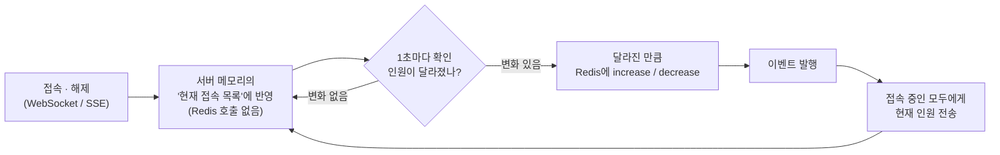
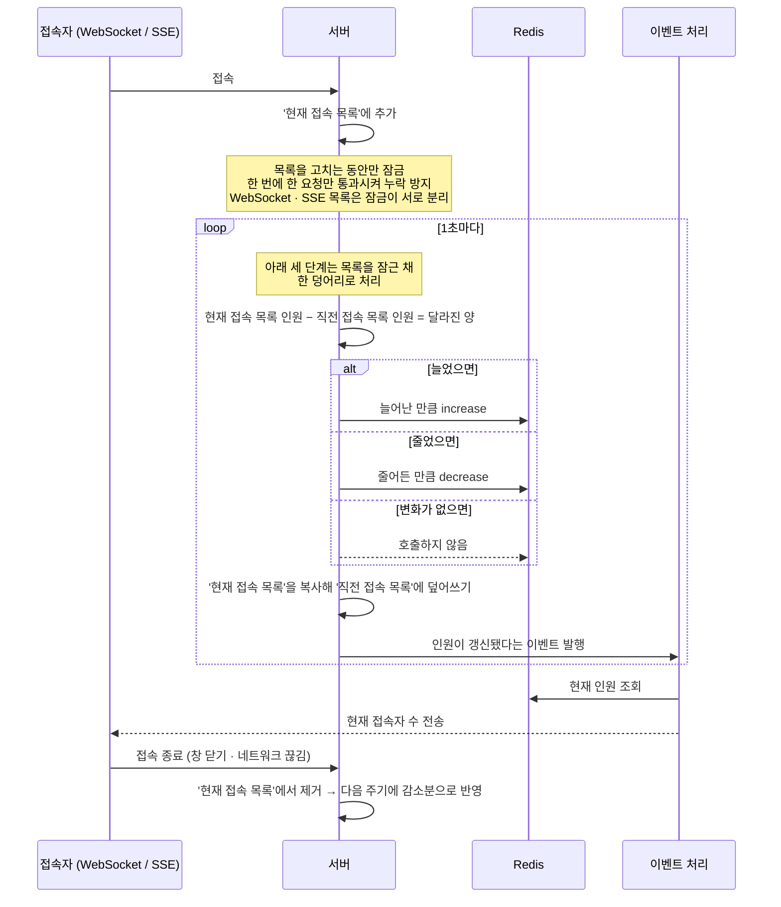

# websocket-and-sse-concurrent-users

Ktor 기반의 **실시간 동시 접속자(Concurrent Users) 집계 서버**입니다.
WebSocket과 SSE(Server-Sent Events) 두 가지 프로토콜로 접속한 클라이언트를 하나의 카운터로 집계하고,
접속자 수가 변할 때마다 연결된 모든 클라이언트에게 현재 동시 접속자 수를 브로드캐스트합니다.

## 목표

- **연결 이벤트마다 Redis를 찌르지 않는다 (핵심 목표)** — 연결 수립/해제는 인스턴스 메모리에만 기록하고, Redis 반영은 1초 주기 스케줄러가 **순증감(delta)만** 모아서 한 번에 처리합니다. Redis 명령 수를 *연결 이벤트 수에 비례*하던 구조에서 *인스턴스 수에 비례*(인스턴스당 최대 초당 1회)하는 구조로 바꾸는 것이 이 프로젝트의 출발점입니다.
- **프로토콜 통합 집계** — WebSocket 연결과 SSE 연결을 구분하지 않고 하나의 동시 접속자 수로 집계합니다.
- **수평 확장** — 카운터를 Redis에 두어 여러 인스턴스가 떠 있어도 전체 동시 접속자 수가 하나로 유지됩니다.
- **중복 이벤트 제거** — 짧은 시간에 몰리는 동일 브로드캐스트 이벤트를 `HashSetChannel`로 합쳐 불필요한 전송을 줄입니다.
- **Graceful shutdown** — 서버 종료 시 자신이 들고 있던 연결 수만큼 Redis 카운터를 되돌려 유령 접속자가 남지 않게 합니다.

## 기술 스택

| 구분 | 내용 |
| --- | --- |
| 언어 / 런타임 | Kotlin 2.1.10, JVM 21 |
| 프레임워크 | Ktor 3.2.1 (Netty Engine) |
| 실시간 | `ktor-server-websockets`, `ktor-server-sse` |
| 저장소 | Redis (Lettuce async client) |
| DI | Koin 3.5.6 |
| 직렬화 | Jackson (JSR-310 모듈 포함) |
| 스케줄러 | [ktor-server-extension/scheduler](https://github.com/lolmageap/ktor-server-extension) |
| 로깅 | kotlin-logging + Logback |
| 빌드 | Gradle (Kotlin DSL), Ktor Gradle Plugin |

## API

| Method | Path | 설명 |
| --- | --- | --- |
| `GET` | `/` | 헬스 체크. `healthy` 를 반환합니다. |
| `WS` | `/ws` | WebSocket 연결. `bye` 를 보내면 서버가 정상 종료 코드로 연결을 닫습니다. |
| `SSE` | `/events` | SSE 연결. `heartbeat` 이벤트가 주기적으로 전송됩니다. |

두 실시간 엔드포인트 모두 동시 접속자 수가 갱신될 때마다 아래 형식의 메시지를 받습니다.

```
concurrentUserCount: 42
```

## 동작 방식

### 한눈에 보기

이 서버가 하는 일은 한 문장으로 **"지금 몇 명이 접속해 있는지 세어서, 접속해 있는 모두에게 알려주는 것"** 입니다.

접속자 수는 Redis에 숫자 하나로 관리합니다. 특징은 이 숫자를 **매 순간 고치지 않고 1초에 한 번 몰아서 고친다**는 점입니다.

- 누군가 접속하거나 나가면 → 서버가 자기 메모리에 들고 있는 **'현재 접속 목록'에만** 넣고 뺍니다. 이때는 Redis를 건드리지 않습니다.
- 1초마다 → **지금 접속 중인 인원**과 **1초 전 인원**을 비교해서, 늘어난 만큼 **Redis에 increase** 하거나 줄어든 만큼 **decrease** 합니다. 이를 위해 서버는 접속 목록을 두 벌(**현재 접속 목록**, 1초 전에 복사해 둔 **직전 접속 목록**) 들고 있습니다.
- 반영이 끝나면 → **이벤트를 발행시켜서**, 접속 중인 모든 사람에게 현재 인원수를 전송합니다.



### 전체 흐름



전송 도중 이미 끊어진 연결이 발견되면 그 자리에서 현재 접속 목록에서 정리하므로, 끊긴 연결이 계속 인원수에 남아 있지 않습니다.

### 핵심 구성 요소

| 파일 | 역할 |
| --- | --- |
| `router/WebSocketRouter.kt` | WebSocket 세션 등록 / 해제 |
| `router/SseRouter.kt` | SSE 세션 등록 / 해제, heartbeat 설정 |
| `scheduler/ConcurrentUserScheduler.kt` | 1초 주기 delta 계산 및 Redis 반영, 이벤트 발행 |
| `event/Channel.kt` | `HashSetChannel` — 중복 이벤트를 제거하는 코루틴 채널 데코레이터 (최대 100,000건 추적) |
| `plugin/Events.kt` | 이벤트 컨슈머. 모든 세션에 동시 접속자 수 브로드캐스트 |
| `external/ReadRedisService.kt`, `WriteRedisService.kt` | Lettuce 비동기 커맨드 래퍼 |
| `plugin/Redis.kt` | Redis 클라이언트 초기화 및 Koin 모듈 등록 |

## 실행

### 사전 준비

Redis가 필요합니다.

```bash
docker run -d --name redis -p 6379:6379 redis:7
```

### 서버 실행

```bash
./gradlew run
```

기본 포트는 `8080`이며 `PORT` 환경 변수로 변경할 수 있습니다.

### 연결 테스트

```bash
# SSE
curl -N http://localhost:8080/events

# WebSocket (websocat 등 사용)
websocat ws://localhost:8080/ws
```

## 왜 스케줄링 방식인가

### 문제 — 연결/해제마다 Redis 호출

동시 접속자 카운터를 구현하는 가장 단순한 방법은 연결될 때 `INCR`, 끊어질 때 `DECR` 하는 것입니다.
하지만 이 방식은 **Redis 명령 수가 연결 이벤트 수에 그대로 비례**합니다.

- 모든 명령이 `concurrent_user` **단일 키 하나**에 몰립니다. Redis는 명령을 단일 스레드로 처리하므로 이 키가 곧 병목 지점이 됩니다.
- 매 호출이 네트워크 왕복이라, **연결 수립 경로 자체가 Redis 레이턴시에 묶입니다.**
- 인스턴스를 늘려 트래픽을 분산해도 Redis로 가는 명령 총량은 줄지 않고 오히려 그대로 합산됩니다.

### 해결 — 메모리에 쌓고, 1초마다 달라진 만큼만 반영

연결과 해제는 **인스턴스 메모리의 접속 목록에만** 반영합니다. 메모리 안에서 끝나는 연산이라 네트워크 호출이 없습니다.
그리고 1초 주기 스케줄러가 접속자 수를 다음과 같이 계산해 Redis에 반영합니다.

서버는 접속 목록을 **두 벌** 들고 있습니다.

- **현재 접속 목록** — 지금 이 순간 연결되어 있는 접속들
- **직전 접속 목록** — 1초 전 주기에 현재 접속 목록을 그대로 복사해 둔 사본

1초마다 이 둘의 인원수를 비교해서, 그 **차이만큼만** Redis에 반영합니다.

| 1초 전 인원 | 지금 인원 | 차이 | Redis에 하는 일 |
| --- | --- | --- | --- |
| 100명 | 130명 | **+30** | 30만큼 increase |
| 100명 | 70명 | **−30** | 30만큼 decrease |
| 100명 | 100명 | **0** | 아무것도 하지 않음 |

여기서 핵심은 Redis에 보내는 값이 *"지금 130명입니다"* 가 아니라 **"30명 늘었습니다"** 라는 점입니다.

- 서버가 여러 대여도 **각자 자기가 맡은 연결의 변화량만** 더하고 빼면, Redis의 숫자는 자연히 전체 서버의 합계가 됩니다. 어떤 서버도 전체 인원을 알 필요가 없고, 서버끼리 대화할 필요도 없습니다.
- 100명이 들어오고 100명이 나간 1초 동안에는 차이가 0이므로 **Redis를 아예 호출하지 않습니다.**

접속 목록은 **WebSocket용과 SSE용을 따로** 관리하지만, **셀 때는 둘을 합친 인원으로 비교**합니다. 그래서 어떤 방식으로 접속했든 하나의 숫자로 집계됩니다.
비교가 끝나면 **현재 접속 목록을 그대로 복사해 직전 접속 목록에 덮어써서** 다음 주기의 기준으로 삼습니다.

즉, 1초 동안 몇 건의 연결 이벤트가 몰리든 **인스턴스 하나가 Redis에 보내는 쓰기 명령은 최대 1회**입니다.

### 동시에 몰려도 숫자가 어긋나지 않는 이유

접속과 해제는 한 줄로 차례차례 들어오지 않고 **수천 건이 동시에** 들어옵니다.
이때 여러 요청이 같은 순간에 **현재 접속 목록**을 고치면, 두 명이 들어왔는데 한 명만 반영되는 식으로 숫자가 어긋날 수 있습니다.

- **현재 접속 목록을 고치는 순간에만 잠금을 겁니다.** 목록에 접속을 넣고 빼는 그 짧은 순간에는 한 번에 한 요청만 들어갈 수 있고, 나머지는 잠깐 기다렸다가 순서대로 처리됩니다.
- **기다리는 동안에도 서버는 멈추지 않습니다.** 스레드를 붙잡고 대기하는 방식이 아니라 기다리는 요청이 잠시 자리를 비켜주는 방식이라, 그 사이 서버는 다른 요청을 계속 처리합니다.
- **WebSocket 접속 목록과 SSE 접속 목록은 잠금을 따로 씁니다.** WebSocket 접속이 몰려도 SSE 접속은 그 뒤에서 기다리지 않습니다.
- **1초마다 도는 집계도 같은 잠금을 잡고 진행합니다.** 인원을 세는 도중에 현재 접속 목록이 바뀌면 계산이 틀어지므로, *두 목록의 인원 비교 → Redis 반영 → 현재 접속 목록을 직전 접속 목록으로 복사* 까지를 잠근 채 한 덩어리로 처리합니다. 덕분에 같은 사람이 두 번 세어지거나 통째로 누락되는 일이 없습니다.

### 접속/해제 100만 TPS 기준 비교

전체 서비스에 **초당 100만 건의 접속과 100만 건의 해제**가 발생하고, 이를 **서버 100대**가 나눠 처리하는 상황을 가정합니다.
인스턴스 1대가 감당하는 양은 접속 10,000 TPS + 해제 10,000 TPS 입니다.

#### 인스턴스 1대 / 1초 기준

| 1초간 이벤트 | 매번 호출 방식 | 스케줄링 방식 | 감소율 |
| --- | --- | --- | --- |
| 접속 10,000 / 해제 0 | `INCR` × 10,000 = **10,000회** | `INCRBY 10000` × 1 = **1회** | 99.99% |
| 접속 10,000 / 해제 10,000 | `INCR` 10,000 + `DECR` 10,000 = **20,000회** | delta = 0 → **0회** | 100% |
| 접속 10,000 / 해제 8,000 | **18,000회** | `INCRBY 2000` × 1 = **1회** | 99.994% |
| 접속 6,000 / 해제 10,000 | **16,000회** | `DECRBY 4000` × 1 = **1회** | 99.994% |

#### 전체 서비스 (서버 100대) 기준

| | 매번 호출 방식 | 스케줄링 방식 |
| --- | --- | --- |
| Redis 쓰기 명령 | 초당 **2,000,000회** | 초당 **최대 100회** (인스턴스당 1회) |
| 증가 요인 | 연결 이벤트 수(TPS)에 비례 | 인스턴스 수에만 비례 |
| 연결 수립 지연 | Redis 왕복 포함 | 메모리 연산만, Redis 무관 |

Redis 단일 노드가 처리할 수 있는 명령 수는 일반적으로 **초당 수만 ~ 십수만 건** 수준입니다.
매번 호출 방식의 초당 200만 건은 이 한계를 크게 넘어서고, 게다가 **단일 키 하나에 몰리는 트래픽이라 샤딩으로 나눌 수도 없습니다.** 카운터 하나 때문에 Redis가 먼저 무너집니다.

반면 스케줄링 방식의 초당 최대 100회는 Redis 처리 용량의 **0.1% 수준**입니다.
접속 트래픽이 100만 TPS에서 1,000만 TPS로 10배가 되어도, 서버 대수를 늘리지 않는 한 Redis 쓰기 명령은 **그대로 초당 100회**입니다.

### 트레이드오프

- **최대 1초의 반영 지연** — 동시 접속자 수는 순간 정확도보다 추세가 중요한 지표이고, 다음 주기에 정확한 값으로 수렴하므로 허용 가능한 오차로 판단했습니다.
- **브로드캐스트 주기도 1초** — 클라이언트가 받는 갱신 주기 역시 최대 1초 간격입니다.
- **비정상 종료 시 카운터 잔존** — 인스턴스가 정상 종료되면 `ApplicationStopPreparing` 훅에서 보유 중이던 연결 수만큼 차감하지만, 강제 종료 시에는 그만큼의 값이 Redis에 남습니다. (TTL 또는 인스턴스별 키 분리로 보완 가능)

## 설정

`src/main/resources/application.conf`

| 키 | 기본값 | 설명 |
| --- | --- | --- |
| `ktor.deployment.port` | `8080` | 서버 포트 (`PORT` 환경 변수로 오버라이드) |
| `ktor.redis.url` | `localhost` | Redis 호스트 |
| `ktor.redis.port` | `6379` | Redis 포트 |
| `ktor.redis.password` | - | Redis 비밀번호 (`REDIS_PASSWORD` 환경 변수) |

## 알려진 이슈 / TODO

- **이벤트 채널 인스턴스 불일치** — `ConcurrentUserEventPublisher`는 전역 `concurrentUserChannel`로 발행하지만, 컨슈머는 `Application.attributes`에 저장된 별도 채널을 구독합니다. Koin에도 세 번째 인스턴스가 등록되어 있어 현재 브로드캐스트가 전달되지 않습니다. 단일 인스턴스로 통일이 필요합니다.
- **설정 키 불일치** — `application.conf`는 `ktor.redis.host`로 정의되어 있으나 `RedisDataSource`는 `ktor.redis.url`을 읽습니다. 항상 기본값 `localhost`로 폴백됩니다.
- **Redis 비밀번호 미적용** — `RedisDataSource.password`를 읽기는 하지만 `RedisClient` 생성 시 URI에 반영되지 않습니다.
- **종료 시 SSE 카운터 미반영** — `ApplicationStopPreparing`에서 `currentSocketConnections.size`만 차감하고 SSE 연결 수는 차감하지 않습니다.
- **SSE heartbeat 주기** — 현재 10ms로 설정되어 있어 트래픽 오버헤드가 큽니다. 실서비스 값으로 조정이 필요합니다.
- 테스트 코드가 아직 없습니다.
